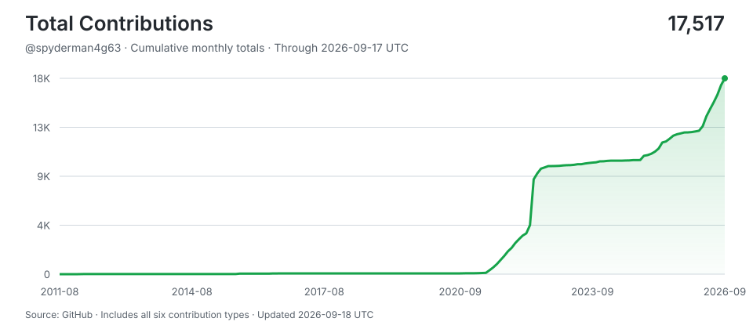

# John Ward

**http://johnathanward.com**

> Shipping with AI agents around the clock -- human hours for thinking, machine hours for doing.
>
> Stats auto-updated by [aidevops](https://aidevops.sh).

<!-- STATS-START -->
## Work with AI

| Metric | Yesterday | Prior 7 Days | Prior 28 Days | Prior 365 Days |
| --- | ---: | ---: | ---: | ---: |
| Screen time (Mac) | 24h | 156.5h | 551.1h | ~6773h* |
| Interactive human attention | 0.0h | 0.0h | 0.0h | 120.2h |
| Interactive AI generation | 0.0h | 0.0h | 0.1h | 160.2h |
| Worker-classified human attention | 0.0h | 0.0h | 0.0h | 0.0h |
| Worker/headless AI generation | 0.6h | 14.3h | 58.9h | 399.9h |
| Additive observed work | 0.6h | 14.3h | 58.9h | 680.4h |
| Interactive sessions | 0 | 1 | 3 | 446 |
| Worker sessions | 26 | 409 | 1,657 | 6,357 |

_Screen time from screen-time-history:daily-observations; collection status: ok. *365-day estimate uses observed calendar coverage._

_Periods are completed local calendar days ending at midnight; today is excluded._

_Human attention is unioned wall-clock time, so overlapping sessions are not double-counted. AI generation is additive machine work across sessions; it is not wall-clock concurrency._

_AI session 365-day totals cover 169 days of local assistant session history (not extrapolated)._

## AI Model Usage (last 30 days)

| Model | Requests | Input | Output | Cache read | Cache Hit-Rate % | Session Count | Session Hours |
| --- | ---: | ---: | ---: | ---: | ---: | ---: | ---: |
| gpt-5.6-terra | 17,560 | 72.5M | 1.9M | 686.3M | 90.4% | 1,741 | 60.5h |
| gpt-5.6-sol | 661 | 2.6M | 89K | 28.7M | 91.5% | 60 | 2.8h |
| gpt-5.6-luna | 1 | 27K | 52 | 0 | 0.0% | 1 | 0.0h |
| **Total** | **18,222** | **75.2M** | **2.0M** | **715.0M** | **90.5%** | **1,802** | **63.3h** |

_792.4M total tokens processed. 90.5% cache hit rate._

## AI Model Usage (all time)

| Model | Requests | Input | Output | Cache read | Cache Hit-Rate % | Session Count | Session Hours |
| --- | ---: | ---: | ---: | ---: | ---: | ---: | ---: |
| claude-sonnet-4-6 | 33,072 | 127.8M | 8.6M | 1,803.3M | 93.4% | 2,059 | 174.8h |
| gpt-5.6-terra | 17,563 | 72.6M | 1.9M | 686.3M | 90.4% | 1,744 | 60.5h |
| gpt-5.5 | 15,312 | 69.8M | 2.3M | 505.9M | 87.9% | 1,669 | 96.8h |
| claude-opus-4-6 | 13,686 | 115.9M | 5.2M | 1,852.3M | 94.1% | 225 | 87.0h |
| gpt-5.6-sol | 10,712 | 39.2M | 1.4M | 452.4M | 92.0% | 892 | 64.9h |
| claude-opus-4-7 | 3,529 | 6K | 2.6M | 540.3M | 100.0% | 39 | 21.8h |
| k2p5 | 2,444 | 47.8M | 790K | 182.3M | 79.2% | 75 | 18.0h |
| gpt-5-codex | 1,366 | 20.5M | 309K | 123.9M | 85.8% | 15 | 5.6h |
| k2p6 | 861 | 4.1M | 266K | 99.0M | 96.0% | 14 | 3.6h |
| gpt-5.4 | 689 | 9.0M | 231K | 61.0M | 87.1% | 24 | 13.8h |
| gpt-5.3-codex-spark | 398 | 2.4M | 189K | 20.0M | 89.0% | 3 | 1.1h |
| gpt-5.3-codex | 352 | 2.5M | 132K | 29.8M | 92.0% | 7 | 2.1h |
| k2p7 | 194 | 1.1M | 98K | 20.1M | 94.8% | 5 | 0.9h |
| k3 | 165 | 797K | 76K | 17.6M | 95.7% | 4 | 1.5h |
| gpt-5.5-fast | 128 | 2.0M | 51K | 14.3M | 87.7% | 1 | 2.3h |
| gpt-5.2-codex | 64 | 372K | 22K | 2.7M | 87.9% | 4 | 0.3h |
| gpt-5.6-luna | 38 | 244K | 3K | 958K | 79.7% | 8 | 0.1h |
| gpt-5.4-fast | 37 | 135K | 3K | 1.6M | 92.6% | 2 | 0.1h |
| claude-sonnet-4 | 35 | 76 | 598 | 142K | 99.9% | 33 | 0.0h |
| kimi-k2.7-code-highspeed | 25 | 90K | 24K | 954K | 91.3% | 3 | 0.1h |
| qwen3.6-plus-free | 17 | 90 | 3K | 713K | 100.0% | 2 | 0.0h |
| big-pickle | 5 | 56K | 827 | 228K | 80.1% | 1 | 0.0h |
| claude-3-sonnet | 4 | 0 | 0 | 0 | 0.0% | 3 | 0.0h |
| pool-account-management | 4 | 0 | 0 | 0 | 0.0% | 3 | 0.0h |
| qwopus | 4 | 0 | 0 | 0 | 0.0% | 3 | 0.0h |
| claude-fable-5 | 2 | 0 | 0 | 0 | 0.0% | 2 | 0.0h |
| minimax-m2.5-free | 2 | 35K | 195 | 35K | 49.9% | 1 | 0.0h |
| nemotron-3-super-free | 2 | 133K | 485 | 0 | 0.0% | 1 | 0.0h |
| qwopus-local | 2 | 0 | 0 | 0 | 0.0% | 2 | 0.0h |
| registry.ollama.ai/library/qwopus:latest | 2 | 22K | 143 | 0 | 0.0% | 1 | 0.0h |
| claude-3-opus | 1 | 0 | 0 | 0 | 0.0% | 1 | 0.0h |
| claude-haiku-4-5 | 1 | 0 | 0 | 0 | 0.0% | 1 | 0.0h |
| gemini-3.1-flash-lite-preview | 1 | 0 | 0 | 0 | 0.0% | 1 | 0.0h |
| gpt-5.1-codex | 1 | 0 | 0 | 0 | 0.0% | 1 | 0.0h |
| gpt-5.5-pro | 1 | 0 | 0 | 0 | 0.0% | 1 | 0.0h |
| mimo-v2-pro-free | 1 | 0 | 0 | 0 | 0.0% | 1 | 0.0h |
| **Total** | **100,720** | **517.2M** | **24.4M** | **6,416.8M** | **92.5%** | **6,769** | **555.4h** |

_7,170.9M total tokens processed. 92.5% cache hit rate._
<!-- STATS-END -->

## Projects

- **[cg_readthedocs](https://github.com/spyderman4g63/cg_readthedocs)** -- No description
## Connect

---

<!-- UPDATED-START -->
_Stats auto-updated 2026-09-05 04:38 UTC by [aidevops](https://aidevops.sh) pulse._
<!-- UPDATED-END -->

<!-- TOTAL-CONTRIBUTIONS-START -->

  <a href="https://commit-history.com/spyderman4g63?metric=total" target="_blank" rel="noopener noreferrer">
    <picture>
      <source media="(prefers-color-scheme: dark)" srcset="assets/contributions/total-dark.svg" />
      
    </picture>
  </a>

[Verify on commit-history.com](https://commit-history.com/spyderman4g63?metric=total) · [Chart data](assets/contributions/total.json)

Includes commits, issues, pull requests, reviews, repositories, and restricted contributions. Refreshed daily through the prior UTC day; commit-history.com may use a different refresh cutoff. GitHub controls link navigation—Ctrl/Cmd-click opens verification in a new tab.
<!-- TOTAL-CONTRIBUTIONS-END -->
